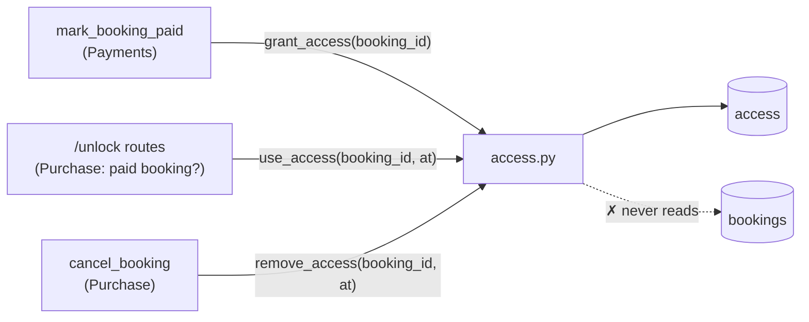
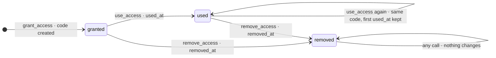

# Access module interface

Status: proposed by the Access team, 2026-10-05. It describes how the rest of Spacey writes to
and reads from Access's `access` table, under the **current OpenAPI**, which this does not change.

- Rules and terms: [spacey-business-rules](https://github.com/cs403bkk-2026/spacey-business-rules)
  `main` (SP-T12, SP-T13, SP-R08, SP-R09) and branch `access/rules-proposal` (SP-R10–SP-R14,
  SP-T15–SP-T19, proposed).
- Table change: the access-table discussion issue ("Access table: state instead of deletion,
  referenced by `booking_id`"). Phase 1 below waits for every team to agree on it.
- Vocabulary: glossary terms only. One *access record* (SP-T17) per booking, *granting access*
  (SP-T18), *access code use* (SP-T19), *removed access* (SP-T16). The table is `access`.
  "Grant" is used only as a verb.

## Boundary

- Only `access.py` reads or writes the `access` table.
- Every function takes the caller's cursor `cur` and a `booking_id`. Nothing else crosses: no
  space, no interval, no payment state. Access never reads `bookings` or `spaces`.
- Purchase decides whether a booking may have access: it exists and it's a paid booking
  (SP-T08). Access doesn't check payment (SP-R10).

## States

`expired` is derived from the booking end and never stored (SP-T15). Nothing needs it yet (Q9).

## Functions

| Function | Kind | Phase | Rule | Contract |
|---|---|---|---|---|
| `grant_access(cur, booking_id) -> dict` | write (create) | 0 | SP-R10, SP-T18 | Creates the access record with a new code, or returns the existing record unchanged. Idempotent; concurrent calls store one record (`INSERT … ON CONFLICT (booking_id) DO UPDATE SET access_code = access.access_code RETURNING *`). Phase 1: a new record is `granted`; a `used` or `removed` record is returned as-is |
| `get_access(cur, booking_id) -> dict \| None` | read | 0 | SP-T17 | The record, or `None`. No side effects |
| `use_access(cur, booking_id, at) -> dict` | write (update) | 1 | SP-R10, SP-T19 | Grants first if there's no record. `granted` → `used`, sets `used_at` **once** (a later use keeps it). Returns the record with the same code. A `removed` record is returned unchanged (the caller answers 404) |
| `remove_access(cur, booking_id, at) -> dict \| None` | write (update) | 1 | SP-R12, SP-R13, SP-T16 | `granted`/`used` → `removed`, sets `removed_at` **once**. Keeps the code and `used_at`. `None` if there's no record. Never deletes, never touches `bookings` or payments |

There's **no delete function**. Access records are never deleted (SP-R12). `reset_tables()` for
tests is the only truncation. The code generator stays as today (`secrets.token_hex(4)`).

**Out of scope:** checking a code against the booking time interval or space (SP-R11, Q9). It
would change the API.

## How the routes use it (same OpenAPI)

| Route | Phase 0 (JOB-1) | Phase 1 (after the issue is agreed) | Responses (unchanged) |
|---|---|---|---|
| `POST /bookings/{id}/pay` | no change | after a successful payment: `grant_access(id)` | as today |
| `POST /bookings/{id}/unlock`, `/confirmation/unlock` | Purchase checks the paid booking (404 / 402), then `grant_access(id)` | same check, then `use_access(id, now)`; `removed` gives 404 | 200 `{booking_id, access_code}`, 402, 404 |
| `DELETE /bookings/{id}` | no change | `remove_access(id, now)` before the existing `DELETE` | 200 with the booking as it was; afterwards 404 |

## Phases

| Phase | Needs | Delivers |
|---|---|---|
| 0 (JOB-1, now) | nothing | `grant_access`, `get_access` on today's table. The `bookings.paid` read moves from `access.py` to Purchase. Same behaviour, same tests |
| 1 (after agreement) | the access-table change (`status`, `used_at`, `removed_at`, no FK) | `use_access`, `remove_access`; calls from pay and cancel |

## Tests

`tests/test_access.py`: 6 phase-0 tests, plus 12 phase-1 tests that skip until the columns exist.
Each test skips until its function exists. The existing `tests/test_app.py` unlock and cancel
tests must stay green, unchanged.
