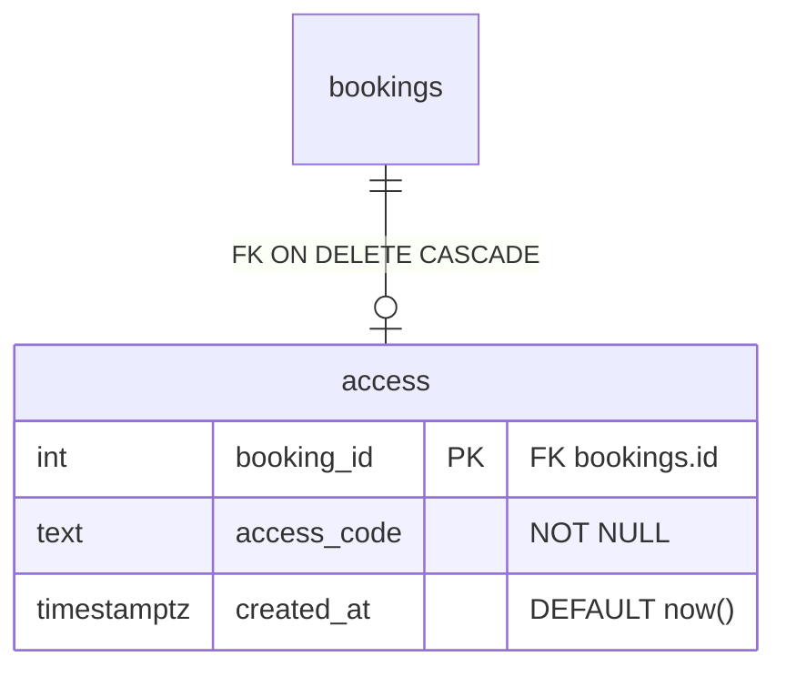
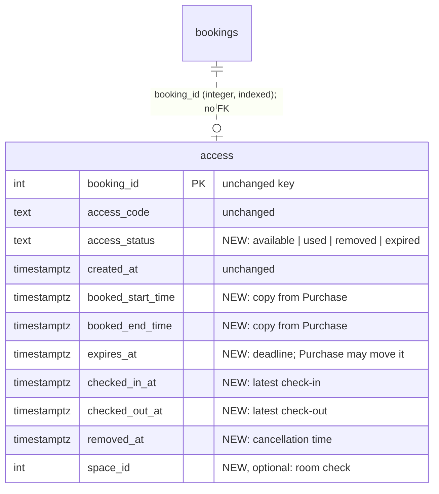
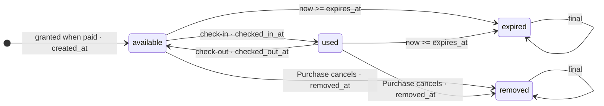

# `access` table: current vs proposed

Status: **proposed** by the Access team, 2026-10-06. Nothing here is implemented. Only the
`access` table is covered; `bookings` and every other table stay as they are.

Terms follow `spacey-business-rules`: SP-T12 *Access to the space*, SP-T13 *Access code*,
SP-T04 *Booking time interval*, SP-R09 (cancellation removes access). Proposed terms for
*available*, *check-in*, *check-out* and *expired* are still to be added there.

## Current (`spacey` main, `b4fec38`, `app.py` `get_connection()`)

```sql
CREATE TABLE IF NOT EXISTS access (
    booking_id  INTEGER PRIMARY KEY REFERENCES bookings (id) ON DELETE CASCADE,
    access_code TEXT NOT NULL,
    created_at  TIMESTAMPTZ NOT NULL DEFAULT now()
);
```



- **One row per booking:** created on the first `POST /bookings/{id}/unlock` of a paid booking, and reused after that (#214).
- **No state:** the table can't say whether a code was used, has expired, or was cancelled.
- **Cancel deletes the record:** `DELETE /bookings/{id}` removes the access row through `ON DELETE CASCADE`.
- **Cross-table read:** `access.py` reads `bookings.paid` to decide.

## Proposed

```sql
CREATE TABLE IF NOT EXISTS access (
    booking_id        INTEGER PRIMARY KEY,          -- integer reference to bookings.id; no FK, no CASCADE
    access_code       TEXT NOT NULL,
    access_status     TEXT NOT NULL DEFAULT 'available'
                      CHECK (access_status IN ('available', 'used', 'removed', 'expired')),
    created_at        TIMESTAMPTZ NOT NULL DEFAULT now(),
    booked_start_time TIMESTAMPTZ,                  -- copy of bookings.start_time
    booked_end_time   TIMESTAMPTZ,                  -- copy of bookings.end_time
    expires_at        TIMESTAMPTZ,                  -- when the code stops working; default booked_end_time
    checked_in_at     TIMESTAMPTZ,                  -- latest check-in
    checked_out_at    TIMESTAMPTZ,                  -- latest check-out
    removed_at        TIMESTAMPTZ,                  -- when Purchase cancelled
    space_id          INTEGER                       -- optional: copy of bookings.space_id, for a room check
);
```



## Column by column

| Column | Current | Proposed | Set by | Why |
|---|---|---|---|---|
| `booking_id` | PK, FK `ON DELETE CASCADE` | PK, **no FK** | grant | The record must survive a cancel (SP-R09). It stays the integer key other tables refer to |
| `access_code` | `TEXT NOT NULL` | unchanged | grant | SP-T13 |
| `created_at` | `DEFAULT now()` | unchanged | grant | When access was granted and the code created |
| `access_status` | — | **new** | every state change | The state of the access (below) |
| `booked_start_time` | — | **new** | grant; Purchase on interval change | Check-in is refused before the booked interval (SP-T12) |
| `booked_end_time` | — | **new** | grant; Purchase on interval change | The end of the booked interval (SP-T04) |
| `expires_at` | — | **new** | grant (= `booked_end_time`); Purchase may move it | When the code stops working. A deadline, so `expires_at` |
| `checked_in_at` | — | **new** | check-in | The latest check-in |
| `checked_out_at` | — | **new** | check-out | The latest check-out |
| `removed_at` | — | **new** | Purchase's cancel | When access was removed, kept once |
| `space_id` | — | **new, optional** | grant | Lets check-in refuse a code at the wrong room (SP-R08). Pending decision |

**Naming:** `_time` for the booked-interval copy (as `bookings.start_time` / `end_time`); `_at` for
events and deadlines (as `created_at`). All columns are `TIMESTAMPTZ`, so "date" isn't used.

## States



| `access_status` | Meaning |
|---|---|
| `available` | The code can be used now; nobody is checked in |
| `used` | Checked in, and not checked out yet |
| `removed` | Purchase cancelled the booking; access removed (SP-R09). Final. The code is kept |
| `expired` | `expires_at` has passed. Final, unless Purchase moves `expires_at` (pending decision) |

The lock is mocked, so `used` is not proof that anyone entered.

## Migration (in `get_connection()`; it runs on every start, so each step must be safe to repeat)

1. **Add each new column** with `ADD COLUMN IF NOT EXISTS`, nullable. `access_status` gets `NOT NULL DEFAULT 'available'`: every existing row has a code nobody has checked in with.
2. **Backfill** `booked_start_time`, `booked_end_time` (and `space_id`) from `bookings`, only `WHERE ... IS NULL`. This is a one-time read of Purchase's data **during the migration only**, and needs Purchase's agreement.
3. **Set** `expires_at = booked_end_time`, only `WHERE expires_at IS NULL`.
4. **Mark expired:** `access_status = 'expired'` where `expires_at <= now()` and the status is `available`. These are old rows only.
5. **Drop the FK:** `DROP CONSTRAINT IF EXISTS access_booking_id_fkey`, which removes `ON DELETE CASCADE`.

**Rollback:** the previous revision still runs. It inserts only `booking_id` and `access_code`; the other columns take their defaults or stay NULL.

## Pending decisions (before this is built)

- whether to keep `space_id` (the room check)
- whether moving `expires_at` later may turn `expired` back into `available`
- adding the glossary terms *available*, *check-in*, *check-out* and *expired*
- check-in and check-out need new API endpoints, agreed with Frontend (an OpenAPI change)
- Purchase agrees to call Access on cancel (`remove_access`) and on an interval change, and to the one-time backfill read
