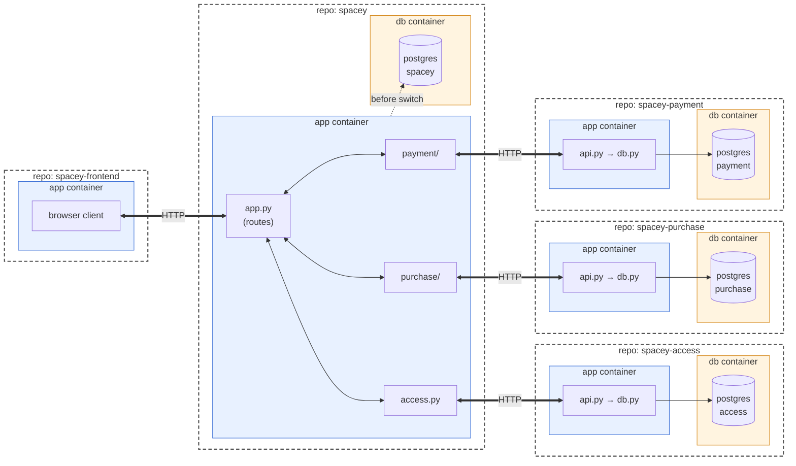
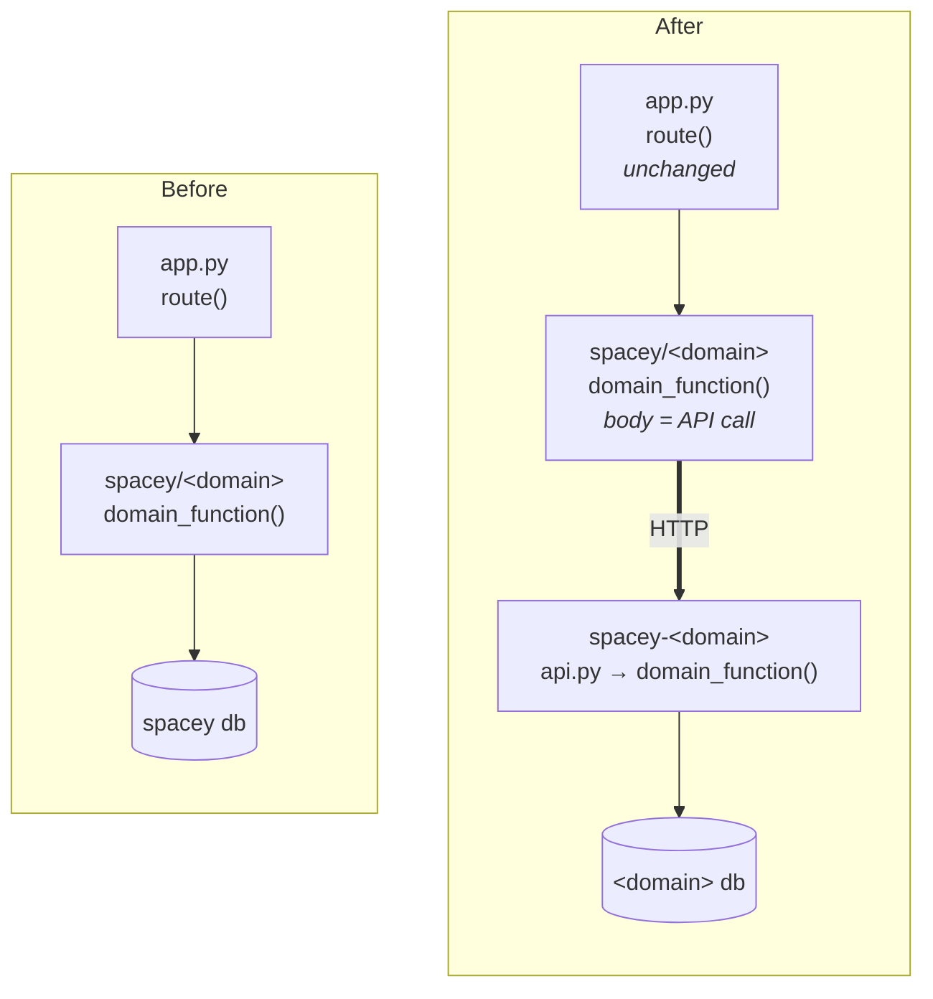
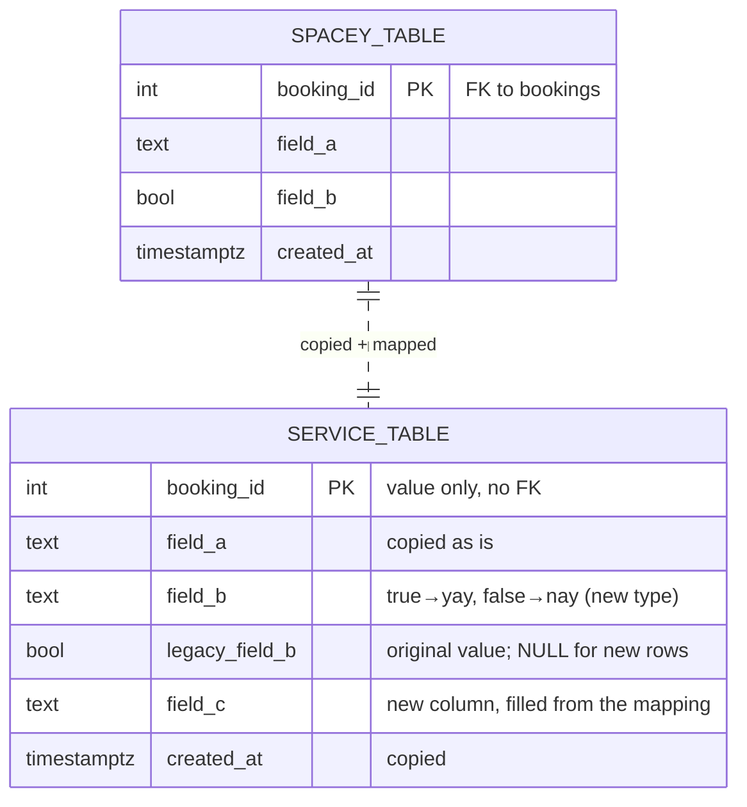
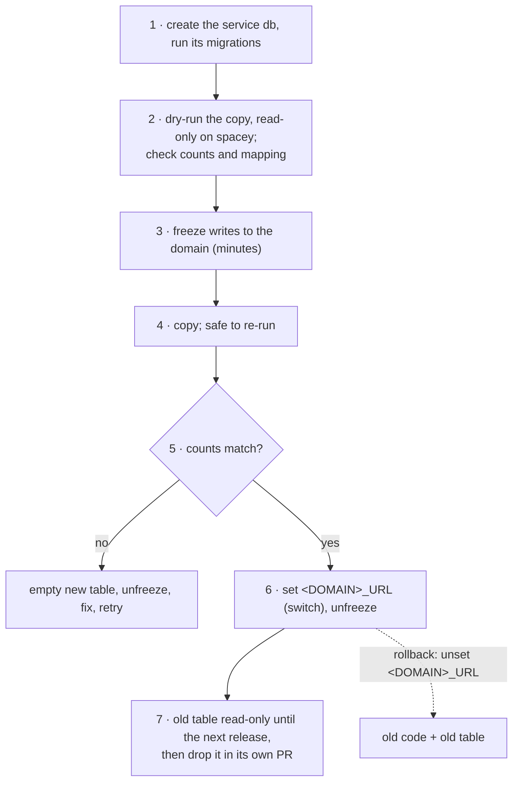
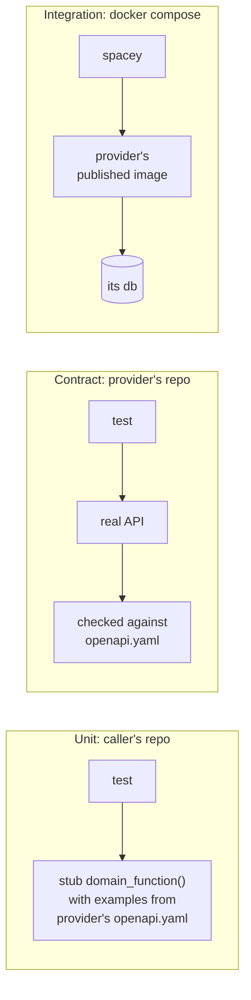

# ADR 0005: Link services through domain functions; move data copy-then-switch

Date: 2026-10-09

Author: Access team (Architect)

Status: Proposed for all teams. Needs agreement from Purchase, Payments, Access, Frontend and the SRE.

## Context

Each domain is leaving the `spacey` monolith for its own repository and database. Frontend must keep working throughout, and no team should have to change another team's code when a domain moves. ADR 0004 already defines Payments–Purchase as plain function calls inside the monolith. This ADR sets the general rule for turning such functions into service calls, and for moving each domain's data.

## Decision

1. **Link through domain functions.** Code calls another domain only through that domain's function in `spacey`. When the domain becomes a service, its owning team changes only that function's body to call the service's API. Nothing calls another domain's API directly.
2. **Move data copy-then-switch.** Copy the domain's tables into the service's database, verify, then switch. A schema change is a mapping applied during the copy.
3. **Test at the function.** Callers stub the domain function. Integration tests run the provider's real image.

### Repositories



| Boundary | Meaning |
|---|---|
| **repo** (dashed) | One team owns it, versions it and releases it on its own |
| **app container** (blue) | One deployable process (Nomad job / compose service) |
| **db container** (orange) | One Postgres per service; only that service's app container connects to it |
| **⇄ HTTP** (thick) | The only way across a container boundary |
| **⇢ before switch** (dotted) | `spacey`'s domain modules still use `spacey db` until that domain's switch (§2) |

`spacey` keeps the routes Frontend calls. Each domain module in `spacey` becomes a thin client of its service, owned by that service's team.

```
$ tree spacey                              $ tree spacey-<domain>
spacey                                     spacey-<domain>
├── app.py          routes (unchanged)     ├── app.py
├── access.py       ← Access team          ├── src
├── purchase/       ← Purchase team        │   ├── api.py           receives HTTP, calls db.py
├── payment/        ← Payments team        │   ├── db.py            the domain functions + SQL
└── tests                                  │   └── <other>_client.py  calls to other services
                                           ├── migrations
                                           ├── openapi.yaml         the contract
                                           └── tests
```

### 1. Linking: the function stays, its body changes



| Rule | Why |
|---|---|
| The function keeps its signature and return shape | Routes, other domains and Frontend don't change |
| The **owning team** maintains its function in `spacey` | The team that changes the API fixes its caller |
| Only that function calls the service. Inside every service, other services are reached through one `<other>_client.py` | One place to change; one place to stub |
| The function maps network failures (timeout, 5xx) to its normal error shape, e.g. `503 {"error": …}`; every call has a timeout | No raw exceptions reach Frontend |
| Data the service can't read stays on the caller's side and is passed in | No reads across databases |
| One env var per service, `<DOMAIN>_URL`: unset runs the old local code, set calls the service | Switch and roll back without a code change |

### 2. Moving data

**Without a schema change:** create the same table in the service's database and copy rows as they are.

**With a schema change:** write the old→new mapping first, then apply it during the copy.



- `booking_id` stays the shared identifier, but as a plain value: foreign keys can't cross databases.
- When an old value has no exact new value, keep the original in **one** nullable `legacy_<field>` column for audit. Readers use only the new column.

**Procedure:** each step can be undone.



Copy **before** switching, never after. Switching first makes existing records look missing, and the service may create duplicates that the copy then collides with.

### 3. Tests



A team builds a mock container only when its real service can't run locally, for example because it needs an external provider.

## Alternatives considered

| Alternative | Why not |
|---|---|
| Routes call services' APIs directly | Every route changes at cutover; failure handling is copied everywhere |
| Frontend calls each service | Frontend changes and new routing per service; ADR 0002 keeps `spacey` as its API |
| Switch first, copy after | Records missing in the gap; duplicates |
| `field_old` + `field_new` columns | Every reader checks two columns forever |
| Dual-write to both databases | More code and failure modes than a short freeze at our data size |
| Hand-built mock container per team | A second implementation to keep in sync; the real image is already a container |

## Consequences

- No foreign keys or transactions across databases. A service trusts the `booking_id` and the facts it is sent.
- A local call becomes a network call. Each domain function must define its answer when the service is down.
- Reporting (ADR 0001) reads `spacey`'s database. When a table moves, its reporting view must move to a read-only view in the new database.
- After the switch, rolling back loses writes made in the service, so the window before dropping the old table stays short.
- ADR 0004's function contract is the "before" state for Payments: when Payments becomes a service, only those functions' bodies change.

## Verification requirements

Acceptance requirements per domain, not executed results:

- With `<DOMAIN>_URL` unset and then set, `spacey`'s existing tests pass unchanged.
- A provider timeout gives the function's error shape, not a 500 with a traceback.
- The copy's dry run and real run report equal counts, and a second run changes nothing.
- Unsetting `<DOMAIN>_URL` restores the old behaviour.

## References

- [ADR 0001: Move reporting to Grafana](0001-move-reporting-to-grafana.md)
- [ADR 0002: Separate the browser client](0002-separate-frontend-repository.md)
- [ADR 0004: Payments–Purchase contract](0004-payments-purchase-contract.md) (branch `pt-002-payments-purchase-adr`, not merged at time of writing)
- `spacey-access` ACC 0002: a worked example of one domain moving under these rules
